<div align="center">


</div>

<div align="center">
  
### `< Full-Stack Developer />` • `{ Building Digital Dreams }` • `[ Sri Lanka 🇱🇰 ]`


</div>

<br>

<div align="center">

[](http://bihanganimhan.me)
[](https://www.linkedin.com/in/bihanga-nimhan-48718a217/)
[](mailto:your.email@example.com)
[](https://github.com/BihangaNimhan)

</div>

<br>


<br>

## 🚀 About Me

```typescript
const bihanga = {
    role: "Full-Stack Developer",
    company: "Exon Software Solutions",
    location: "Sri Lanka 🇱🇰",
    experience: "4+ years",
    passion: "Turning Coffee into Code ☕️",
    
    currentlyWorking: {
        focus: ["Enterprise Web Apps", "Mobile Development", "API Architecture"],
        learning: ["React.js", "Laravel", "System Design"]
    },
    
    techStack: {
        languages: ["Java", "JavaScript", "PHP"],
        frontend: ["React", "HTML5", "CSS3"],
        backend: ["Node.js", "Laravel", "Express"],
        mobile: ["Android"],
        databases: ["MySQL", "MongoDB", "PostgreSQL"],
        tools: ["Git", "Docker", "VS Code"]
    },
    
    workStyle: {
        approach: "Agile Development",
        quality: "Clean, Maintainable, Scalable",
        availability: "Remote | Freelance | Full-Time"
    },
    
    funFact: "I debug with console.log() and I'm not ashamed! 😄"
};
```

<br>


<br>

## 🛠️ Tech Arsenal

<div align="center">

### Languages & Frameworks


### Databases & Tools


</div>

<br>


<br>

## 📊 GitHub Analytics

<div align="center">
  
  
</div>

<div align="center">
  
  
</div>

<br>

<div align="center">
  
</div>

<br>


<br>

## 💼 Featured Work

<div align="center">

<table>
<tr>
<td width="50%">
<h3 align="center">🎬 EditCinema.com</h3>
<div align="center">  
<a href="https://github.com/BihangaNimhan/editcinema.com" target="_blank">

</a>
<br><br>
<p><strong>JavaScript • HTML • CSS</strong></p>
<p>Professional video production platform with stunning UI/UX</p>
</div>
</td>

<td width="50%">
<h3 align="center">📱 JIAT Notifications</h3>
<div align="center">
<a href="https://github.com/BihangaNimhan/javaInstitute_NotificationApp" target="_blank">

</a>
<br><br>
<p><strong>JavaScript • Firebase</strong></p>
<p>Real-time educational communication system</p>
</div>
</td>
</tr>

<tr>
<td width="50%">
<h3 align="center">🌦️ Weather Forecast</h3>
<div align="center">
<a href="https://github.com/BihangaNimhan/Weather-Forecast" target="_blank">

</a>
<br><br>
<p><strong>JavaScript • API Integration</strong></p>
<p>Interactive weather app with live data</p>
</div>
</td>

<td width="50%">
<h3 align="center">📊 Assignment System</h3>
<div align="center">
<a href="https://github.com/BihangaNimhan/Assignment_3" target="_blank">

</a>
<br><br>
<p><strong>Java • MySQL</strong></p>
<p>Complete management platform</p>
</div>
</td>
</tr>
</table>

</div>

<br>


<br>

## 🎯 What I'm Up To

```mermaid
%%{init: {'theme':'dark'}}%%
graph LR
    A[Learning React.js] --> B[Building Projects]
    B --> C[Mastering Laravel]
    C --> D[System Design]
    D --> E[Next Big Thing! 🚀]
    
    style A fill:#00D9FF,stroke:#00D9FF,color:#000
    style B fill:#00D9FF,stroke:#00D9FF,color:#000
    style C fill:#00D9FF,stroke:#00D9FF,color:#000
    style D fill:#00D9FF,stroke:#00D9FF,color:#000
    style E fill:#FF6B6B,stroke:#FF6B6B,color:#fff
```

<div align="center">



</div>

<br>


<br>

## 💬 Let's Connect!

<div align="center">

### 📫 I'm always excited to collaborate on interesting projects!

**Whether you need a developer, want to collaborate, or just chat about tech - I'm here! 🚀**

<br>

[](https://www.linkedin.com/in/bihanga-nimhan-48718a217/)
[](http://bihanganimhan.me)
[](mailto:your.email@example.com)

<br>

### ☕ Support My Work

**If you like what I do, consider buying me a coffee!**

[](https://www.buymeacoffee.com/BihangaNimhan)
[](https://paypal.me/BihangaNimhan)

</div>

<br>


<br>

<div align="center">

### 💭 Random Dev Quote


<br>

### 🐍 Watch My Contribution Snake Eat My Contributions!

<picture>
  <source media="(prefers-color-scheme: dark)" srcset="https://raw.githubusercontent.com/BihangaNimhan/BihangaNimhan/output/github-contribution-grid-snake-dark.svg">
  <source media="(prefers-color-scheme: light)" srcset="https://raw.githubusercontent.com/BihangaNimhan/BihangaNimhan/output/github-contribution-grid-snake.svg">
  
</picture>

</div>

<br>

<div align="center">
  


<br>

### ⭐ Don't forget to star repos you find interesting!

<br>

**Made with ❤️ and lots of ☕ by Bihanga Nimhan**

```javascript
while(alive) {
    eat();
    sleep();
    code();
    repeat();
}
```

</div>


